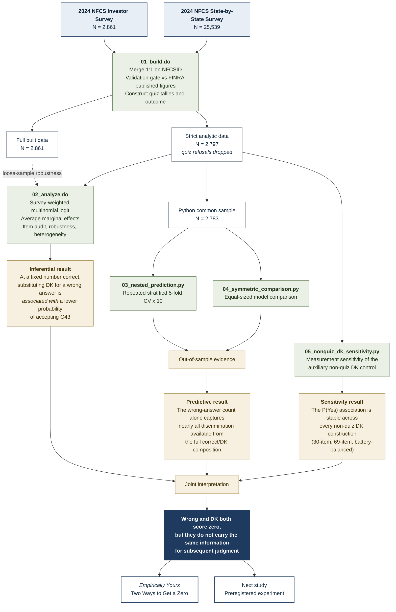

# Two Ways to Get a Zero

**Household Finance Lab · Project 1 · 2024 NFCS Investor Survey**

Wrong answer: zero. Don't know: zero. Same score — but are they telling us the same thing?

Among investors who answered the same number of knowledge questions correctly, each additional "don't know" in place of a wrong answer was associated with about a **4.7 percentage-point lower probability** of accepting an investment promising a guaranteed, risk-free 25% annual return.

📖 **[Read the full write-up →](docs/empirically-yours-01-two-ways-to-get-a-zero.md)** *(Empirically Yours №1 — the story, in plain language)*

> **Research status:** exploratory analysis of observational data. **Not peer reviewed.** The expectation was formalized after a related result was already known, and this is documented rather than obscured. See `ANALYTICAL-DECISIONS.md`.

---

## What's here

| File | What it is |
|---|---|
| [`docs/empirically-yours-01-two-ways-to-get-a-zero.md`](docs/empirically-yours-01-two-ways-to-get-a-zero.md) | The readable write-up: what we asked, what we found, and where we were wrong |
| [`CODEBOOK.md`](CODEBOOK.md) | Every variable used, answer keys, derived measures, and how to rebuild them in R, SPSS, or Python |
| [`ANALYTICAL-DECISIONS.md`](ANALYTICAL-DECISIONS.md) | Every consequential choice, its alternative, and whether the number changed — including three interpretations we discarded |
| [`docs/workflow.md`](docs/workflow.md) | One-page map from the two source datasets through Stata inference, Python prediction, measurement sensitivity, and the next experiment |
| [`LITERATURE.md`](LITERATURE.md) | Who established what before us, on what data, and what remains open. A living map: entries carry verification markers |
| [`data/README.md`](data/README.md) | Where to get the source data, what the build expects, how to verify your build |
| [`docs/nonquiz-dk-sensitivity-interpretation.md`](docs/nonquiz-dk-sensitivity-interpretation.md) | Measurement audit of the auxiliary DK control, undertaken after we found the original was under-specified |
| [`docs/REPRODUCTION-STATUS.md`](docs/REPRODUCTION-STATUS.md) | The end-to-end verification run: what reproduced, to what tolerance, and the one table it corrected |

## Repository layout

```
code/      Build, analysis, prediction, and sensitivity scripts, in run order
data/      Where you place the FINRA source files. Nothing is redistributed here
docs/      Write-up, workflow map, measurement audit, item audit table
output/    Aggregate result tables. Built datasets land here and stay gitignored
logs/      Stata run logs from the build and analysis, committed as receipts
```

All scripts resolve their paths relative to the repository root. Run them from
the root and nothing needs editing.

## Study workflow



**How to read it.** The three branches answer different questions. Stata estimates the survey-weighted association; Python asks what predicts responses out of sample; the measurement-sensitivity branch asks whether the auxiliary non-quiz DK construction changes the inferential result. They complement one another, but none converts this observational study into a causal design.

The sample moves from 2,861 Investor Survey respondents to 2,797 after the strict quiz-refusal rule, 2,796 where valid G43 is required, and 2,783 for the common predictive comparison.

See [`docs/workflow.md`](docs/workflow.md) for the full workflow notes.

## Instructions to replicators

**Software.** Stata 16 or later (for `svy:` estimation and `margins`). Python 3.10+ with `pandas`, `numpy`, `scipy`, and `scikit-learn` — see `code/requirements.txt`.

**Data.** Not included in this repository. Download the 2024 NFCS Investor Survey and State-by-State Survey from the [FINRA Investor Education Foundation](https://www.finrafoundation.org/nfcs-data-and-downloads), free and without registration, and place the `.dta` files in `data/`. Full instructions in [`data/README.md`](data/README.md).

**Run order.**

```
code/01_build.do                      # merge, construct, validate, freeze
code/02_analyze.do                    # descriptives, item audit, models, robustness
code/03_nested_prediction.py          # nested out-of-sample comparison
code/04_symmetric_comparison.py       # symmetric response-composition diagnostic
code/05_nonquiz_dk_sensitivity.py     # measurement sensitivity of the auxiliary control
```

**Runtime.** The Stata scripts run in under two minutes. The Python scripts take roughly five, most of it in repeated cross-validation.

**How you know it worked.** `01_build.do` asserts its expected values in code and halts if the reconstruction drifts. A successful build reports a weighted mean correct of 5.33 against FINRA's published 5.3, male and female incorrect counts of 3.31 and 3.33 (both rounding to the published 3.3), 64 respondents with quiz refusals, and an analytic sample of 2,797. If the gate prints `VALIDATION GATE PASSED`, your build matches ours.

## What this study supports

Among Investor Survey respondents with the same number of correct quiz answers, replacing an incorrect response with a "don't know" is associated with a lower probability of accepting the implausible proposition. The association remained across the inferential specifications examined and across every defensible construction of the auxiliary non-quiz DK control.

The predictive analysis adds a different result. Out of sample, the number of wrong answers alone captured nearly all the discrimination available from the full correct/DK response composition. For this judgment, conventional scoring therefore discards information when it gives a wrong answer and "don't know" the same zero.

It does **not** establish why respondents select DK, that DK is inherently beneficial, or that changing DK behavior would improve judgment. Nobody was assigned to say "I don't know."

## Things we got wrong

Three interpretations were revised during this project, and all three are documented rather than quietly dropped:

- a nested-model result that turned out to depend on the order variables were entered;
- a coefficient read as though it were a marginal effect;
- an auxiliary index whose item list was anchored on an earlier version rather than derived from a stated rule.

The third prompted a full measurement audit. The central result survived it.

## Tell us we're wrong

Open an Issue on this repository, or email householdfinancelab@gmail.com. Corrections, failed reproductions, and "you've mischaracterized my paper" messages are all welcome — that's a large part of why the work is here.

## Using this work

Code: MIT. Written research and documentation: CC BY 4.0. See [`LICENSE`](LICENSE). No survey data are redistributed here; the NFCS belongs to the FINRA Investor Education Foundation.

Citation information is in [`CITATION.cff`](CITATION.cff), which GitHub renders as a "Cite this repository" button.
