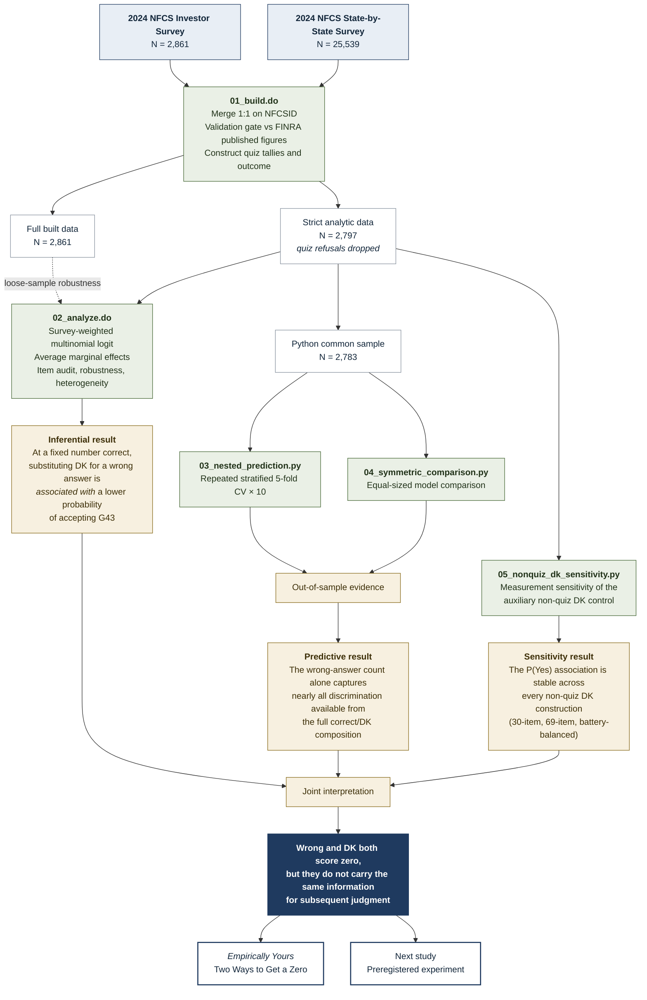

# Study Workflow

How Project 1 runs, from the two public-use source files to the two things that came out the other end.

**Reading it.** Blue is source data, green is code, white with a grey outline is a frozen dataset, sand is a result, and the dashed line is the one place the analysis reaches back to the full built file — the loose-sample robustness check, which needs the 64 respondents the strict rule drops.

**Sample sizes.** 2,861 respondents in the Investor Survey → 2,797 after dropping anyone with a refusal on the 11 quiz items → 2,796 in models requiring valid G43 → 2,783 in models also requiring valid self-assessed knowledge, which is the common sample the nested predictive comparison uses so that every specification is scored on identical respondents.

**Not shown.** The validation gate inside `01_build.do` halts the run if the reconstruction drifts from FINRA's published figures; the analysis never starts if it fails. See `ANALYTICAL-DECISIONS.md` §7 and §7a.

---

*This diagram renders natively on GitHub. To use it elsewhere — slides, a poster, LinkedIn — paste the code block into [mermaid.live](https://mermaid.live) and export SVG or PNG.*
